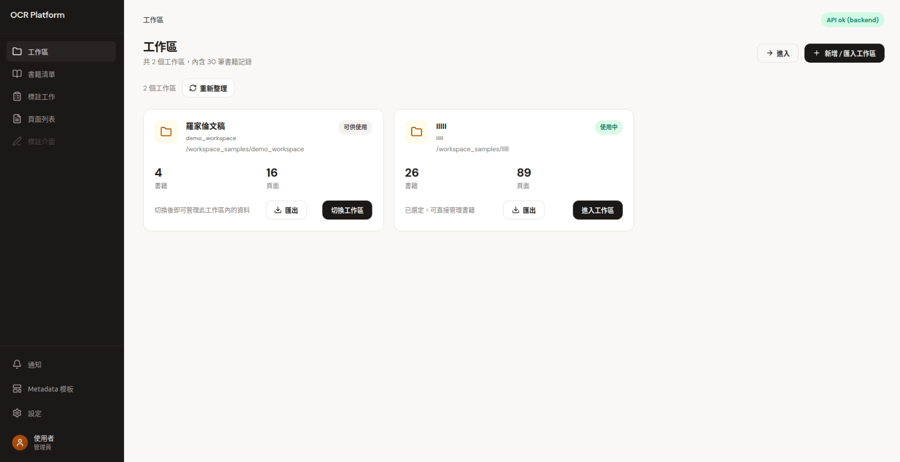
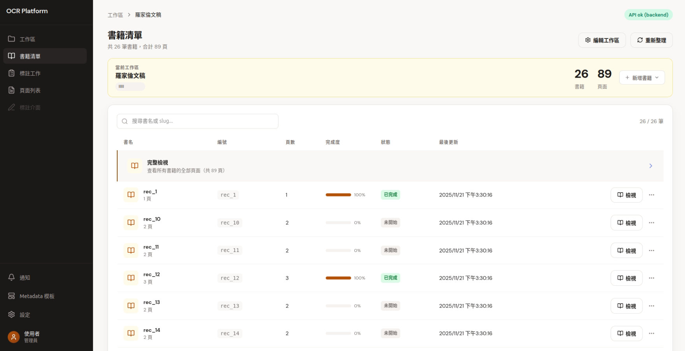
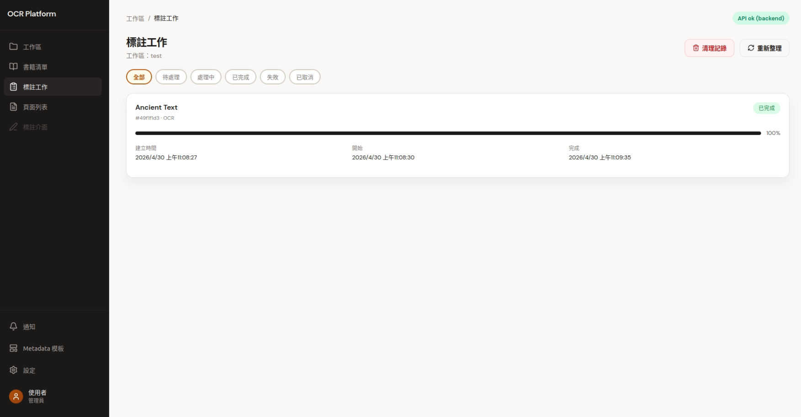
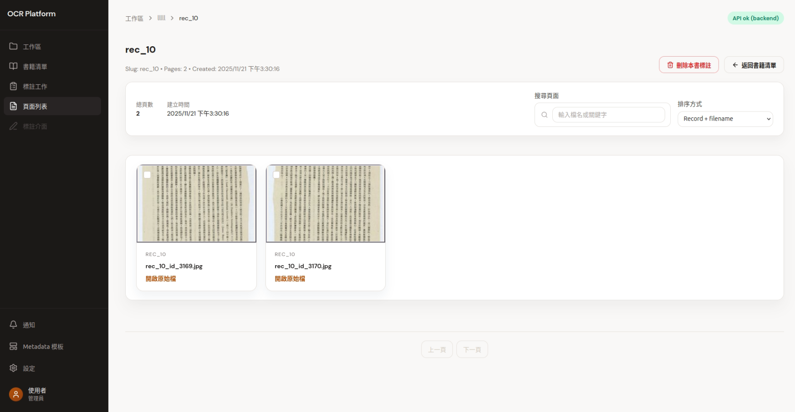
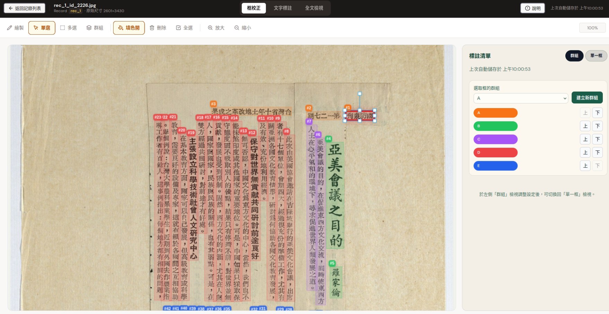
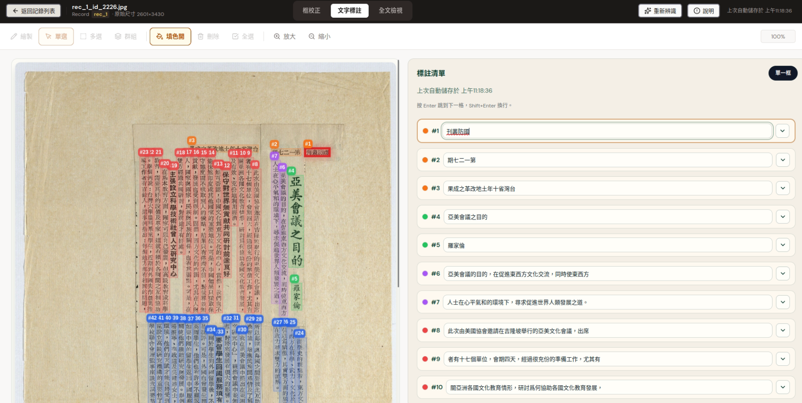
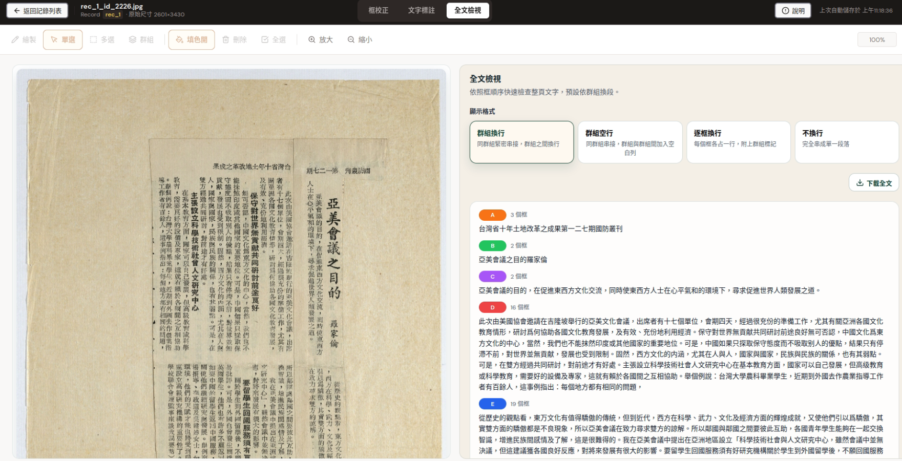

# document-ocr-annotation-system

[](https://deepwiki.com/Jason9339/document-ocr-annotation-system)

A small OCR annotation system (Django backend + React frontend) with example workspace data for local development.

## Quick start (development)

Prerequisites:
- Docker & Docker Compose
- git

Start the app (builds images first time):

```bash
# build and run all services in background
docker compose up -d --build

# view backend logs
docker compose logs -f api

# stop and remove containers
docker compose down
```

If you change Python dependencies, rebuild the backend and worker images:

```bash
docker compose build --no-cache api worker
docker compose up -d
```

Common commands:
- Restart a service: docker compose restart api
- Run Django migrations: docker compose exec api python manage.py migrate
- Run backend tests: docker compose exec api python manage.py test
- Install frontend package: docker compose exec web npm install <pkg>

## System Walkthrough

### 1. Management Dashboard
Manage workspaces, upload books, and track OCR tasks.

| Workspace Overview | Book Management |
| :---: | :---: |
|  |  |
| **Job Progress Tracking** | **Image Gallery** |
|  |  |

### 2. Annotation & Correction
Interactive tools for correcting layout, reading order, and text content.

#### Layout & Reading Order
Support for complex vertical layouts and manual ordering.


#### Text Proofreading
Efficient text correction with "focus mode" (highlighting current box).


#### Structured Export
View full text and export structured data (JSON/Text).


## Project structure

Top-level layout:

```
document-ocr-annotation-system/
├── backend/                    # Django backend
│   ├── config/                 # Django settings and urls
│   ├── records/                # Records & workspace logic (services, views)
│   ├── annotations/            # Annotation-related code
│   └── manage.py               # Django entrypoint
├── frontend/                   # React + Vite frontend
│   ├── src/                    # React source (pages, components, lib)
│   └── package.json
├── workspace_samples/          # Example workspaces and labels (demo data)
├── docker-compose.yml          # Compose services (api, web, worker, redis)
├── DEVELOPMENT_GUIDE.md        # Developer guide (detailed instructions)
└── README.md
```

Notes
- Workspaces are stored under the path configured by the `WORKSPACES_ROOT` environment or Django setting (default: `workspace_samples/`).
- Annotation sidecar files are written to `workspace_samples/{workspace}/labels/{record}/` as JSON per page.

See `DEVELOPMENT_GUIDE.md` for a more detailed developer guide and troubleshooting tips.