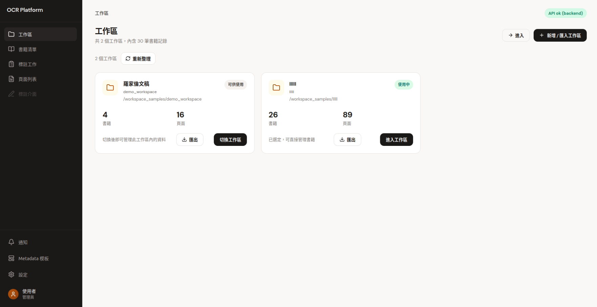
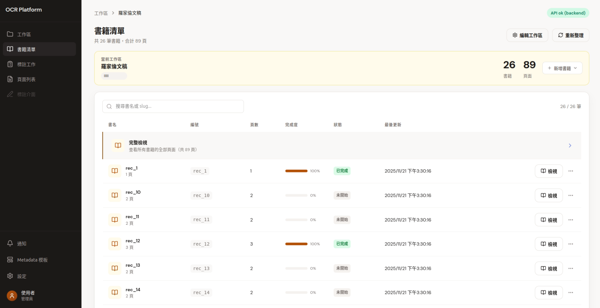
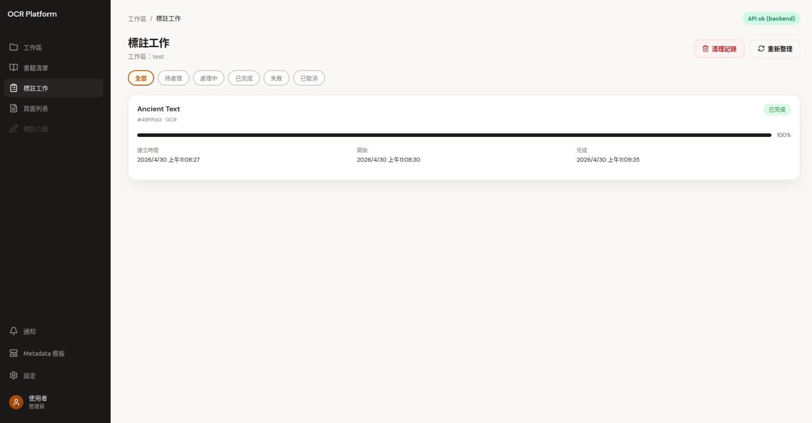
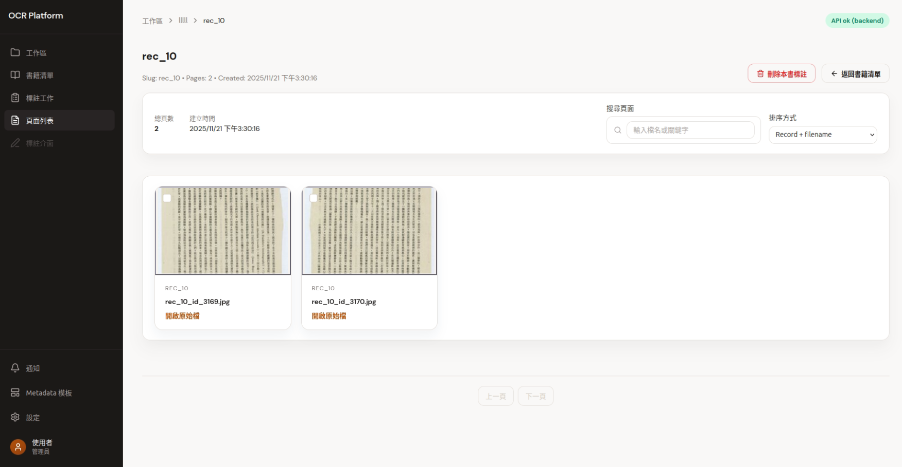
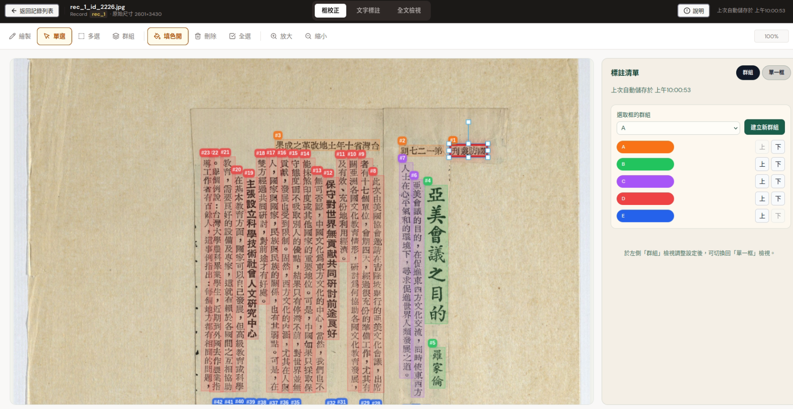
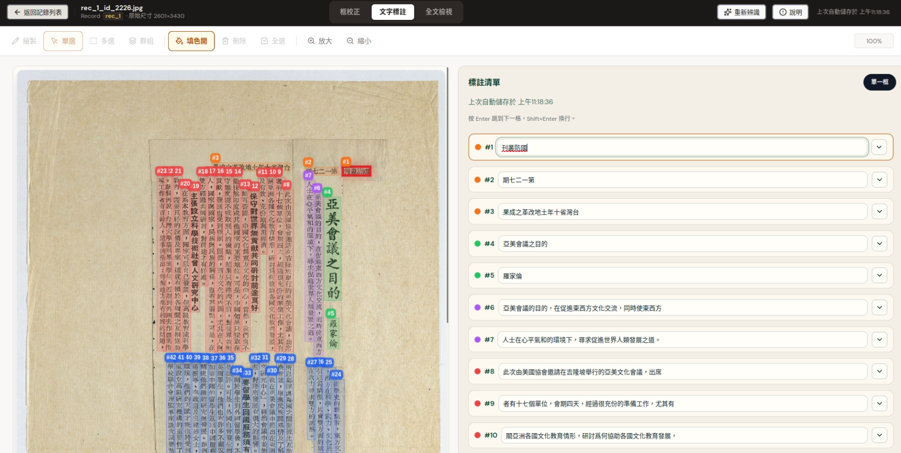
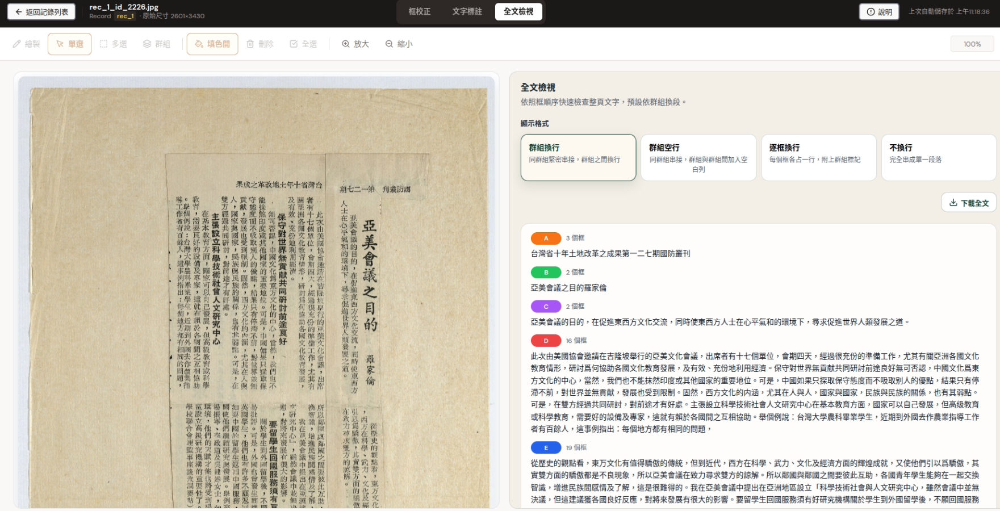

# document-ocr-annotation-system

[](https://deepwiki.com/Jason9339/document-ocr-annotation-system)

A small OCR annotation system (Django backend + React frontend) with example workspace data for local development.

## Quick start (development)

Prerequisites: **Docker & Docker Compose**, **git**

```bash
git clone https://github.com/Jason9339/document-ocr-annotation-system.git
cd document-ocr-annotation-system
./start.sh
```

`./start.sh` 會詢問環境，根據機器選擇：

| 選項 | 適用 | 說明 |
|---|---|---|
| `1` | 一般 x86 工作站 | 使用官方 `paddlepaddle-gpu`（CUDA 12.9） |
| `2` | **NVIDIA DGX Spark**（aarch64） | 首次執行自動下載預編 wheel 並 build image |

開啟瀏覽器：[http://localhost:5173](http://localhost:5173)

---

### 開發常用指令

```bash
# 背景執行
./start.sh -- -d

# 查看 log
sudo docker compose logs -f api        # DGX Spark
docker compose logs -f api             # x86

# 停止
sudo docker compose -f docker-compose.yml -f docker-compose.dgxspark.yml down   # DGX Spark
docker compose down                                                               # x86
```

### 更新 Python 依賴後重建 image

```bash
# x86
docker compose build --no-cache api worker && docker compose up -d

# DGX Spark（重建後再啟動）
sudo docker build -f backend/Dockerfile.dgxspark -t paddleocr-backend:dgxspark .
./start.sh
```

## System Walkthrough

### 1. Management Dashboard
Manage workspaces, upload books, and track OCR tasks.

| Workspace Overview | Book Management |
| :---: | :---: |
|  |  |
| **Job Progress Tracking** | **Image Gallery** |
|  |  |

### 2. Annotation & Correction
Interactive tools for correcting layout, reading order, and text content.

#### Layout & Reading Order
Support for complex vertical layouts and manual ordering.


#### Text Proofreading
Efficient text correction with "focus mode" (highlighting current box).


#### Structured Export
View full text and export structured data (JSON/Text).


## Project structure

Top-level layout:

```
document-ocr-annotation-system/
├── backend/                    # Django backend
│   ├── config/                 # Django settings and urls
│   ├── records/                # Records & workspace logic (services, views)
│   ├── annotations/            # Annotation-related code
│   └── manage.py               # Django entrypoint
├── frontend/                   # React + Vite frontend
│   ├── src/                    # React source (pages, components, lib)
│   └── package.json
├── workspace_samples/          # Example workspaces and labels (demo data)
├── docker-compose.yml          # Compose services (api, web, worker, redis)
├── DEVELOPMENT_GUIDE.md        # Developer guide (detailed instructions)
└── README.md
```

Notes
- Workspaces are stored under the path configured by the `WORKSPACES_ROOT` environment or Django setting (default: `workspace_samples/`).
- Annotation sidecar files are written to `workspace_samples/{workspace}/labels/{record}/` as JSON per page.

See `DEVELOPMENT_GUIDE.md` for a more detailed developer guide and troubleshooting tips.